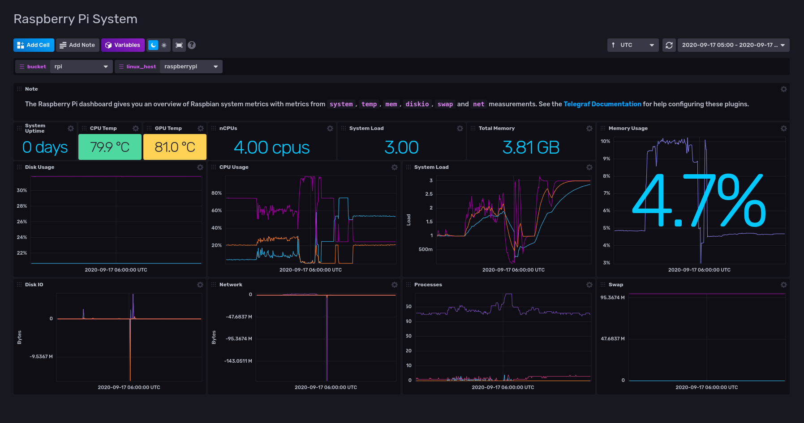

# Raspberry Pi System Template

Provided by: @bonitoo.io

This InfluxDB template can be used to monitor your Raspberry Pi Linux system.

> The Raspberry Pi dashboard gives you an overview of system metrics with
> metrics from `system`, `temp`, `mem`, `diskio`, `swap` and `net` measurements.
> **Raspbian** is supported.



## Quick Install

If you have your InfluxDB credentials
[configured in the CLI](Vhttps://v2.docs.influxdata.com/v2.0/reference/cli/influx/config/),
you can install this template with:

```sh
influx apply -u https://raw.githubusercontent.com/influxdata/community-templates/master/raspberry-pi/raspberry-pi-system.yml
```

## Included Resources

- 1 Bucket: `rasp-pi`, 7d retention
- Labels: `raspberry-pi` + Telegraf Plugin Labels
- 1 Telegraf Configuration
- 1 Dashboard: `Raspberry Pi System`
- 2 Variables: `bucket` and `linux_host`

## Setup Instructions

General instructions on using InfluxDB Templates can be found in the [use a template](../docs/use_a_template.md) document.

- **Install Telegraf** on your Raspberry Pi device. You can use
  [Raspbian installation instructions](https://community.influxdata.com/t/raspberry-pi-installation-instructions/5515).
- To enable GPU temperature measurement, **add the telegraf user to the video
  group** and test the command.

    ```sh
    sudo usermod -a -G video telegraf
    sudo -u telegraf vcgencmd measure_temp
    ```
    
  You may need to logout/log back in for this to take effect.  If running Ubuntu on Raspberry Pi 400, a reboot may be necessary.
  
- Check the location of `vcgencmd` on your Raspberry Pi using
    
    ```sh
    which vcgencmd
    ```
  You may need to change the telegraf configuration to reflect the location of your `vcgencmd`.  Currently, the telegraf configuration is set for
  Ubuntu (Groovy Gorilla):
  
  ```
  [[inputs.exec]]
  commands = ["/usr/bin/vcgencmd measure_temp"]
  name_override = "temperature_gpu"
  data_format = "grok"
  grok_patterns = ["%{NUMBER:value:float}"]
  ```
  
  On Raspberry Pi OS, modify the `commands` line to:
  
  ```
  commands = ["/opt/vc/bin/vcgencmd measure_temp"]
  ```  
  
Telegraf configuration requires the following environment variables:

- `INFLUX_HOST` - The URL of your influxdb server.
- `INFLUX_ORG` - The name of your Organization. Your Organization name can be
  found on the Settings page in your browser. In the **Influxdata Cloud 2** the
  organization is your username.
- `INFLUX_TOKEN` - The token with the permissions to read Telegraf configs and
  write data to the `telegraf` bucket. You can just use your operator token to
  get started. This can be found on the `Load Data` > `Tokens` page in your
  browser

### Command Line Setup

```sh
export INFLUX_HOST=host
export INFLUX_TOKEN=token
export INFLUX_ORG=my_org
```

### SystemD Setup

To **create environment variables** for the systemd **telegraf.service**, define
the variables `INFLUX_TOKEN`, `INFLUX_ORG` and `INFLUX_HOST` in the
`/etc/default/telegraf` file.

```sh
# write this with values to the /etc/default/telegraf file
INFLUX_HOST=host
INFLUX_TOKEN=token
INFLUX_ORG=my_org
```

## Customizations

You can run the provided Telegraf configuration on multiple Linux machines, and
switch between them using the `linux_host` filter at the top of the dashboard.

## Contact

- Author: Ivan Kudibal, Bonitoo s.r.o.
- Github: [Bonitoo.io](https://github.com/bonitoo-io)
- Influx Slack: [@ivankudibal](https://influxdata.com/slack)
