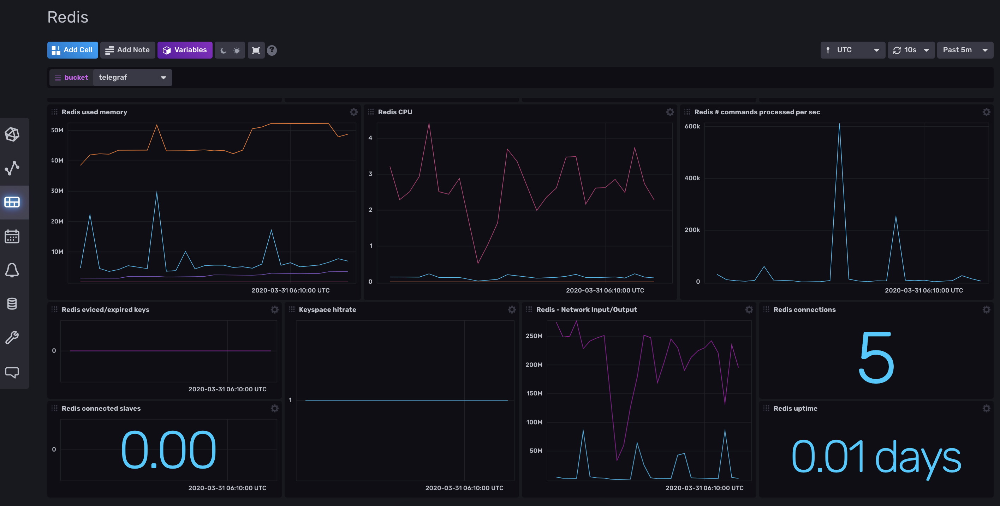

## Redis Monitoring Template

This InfluxDB Template can be used to monitor Redis.



### Quick Install

If you have your InfluxDB credentials [configured in the CLI](Vhttps://v2.docs.influxdata.com/v2.0/reference/cli/influx/config/), you can install this template with:

```
influx apply -u https://raw.githubusercontent.com/influxdata/community-templates/master/redis/redis.yml
```

### Included Resources

- 1 Bucket: `redis`, 7d retention
- Labels: Telegraf Plugin Labels
- 1 Telegraf Configuration
- 1 Dashboard: `Redis`
- 1 Variable: `bucket`

## Setup Instructions
    
  The data for the dashboard is populated by the included Telegraf configuration and the Redis Input plugin. The Redis Input defaults to using `tcp://localhost:6379` as the server. If your redis server is running at a different address or is using authentication, you will need to update this value in the Telegraf configuration. See the [Redis Input Documentation](https://github.com/influxdata/telegraf/tree/master/plugins/inputs/redis#configuration) for more details.
  
  The Telegraf Configuration requires the following environment variables
    
  - `INFLUX_TOKEN` - The token with the permissions to read Telegraf configs and write data to the `telegraf` bucket. You can just use your operator token to get started.
  - `INFLUX_ORG` - The name of your Organization (this will be your email address on the InfluxDB Cloud free tier)
  - `INFLUX_HOST` - The URL of your InfluxDB host (this can your localhost, a remote instance, or InfluxDB Cloud)

  You **MUST** set these environment variables before running Telegraf using something similar to the following commands
    
  - This can be found on the `Load Data` > `Tokens` page in your browser: `export INFLUX_TOKEN=TOKEN`
  - Your Organization name can be found on the Settings page in your browser: `export INFLUX_ORG=my_org`

## Running Telegraf

  To get resource data from your Redis hosts, [download and install Telegraf](https://portal.influxdata.com/downloads/) on those hosts. InfluxData provides native packages for a number of distributions as well as binaries that can be executed directly.

  Start Telegraf using the instructions from the `Load Data` > `Telegraf` > `Setup Instructions` link in the UI.

## Customizations

You can customize it based on your Redis installation. More information can be found in the [Telegraf Redis Input documentation](https://github.com/influxdata/telegraf/tree/master/plugins/inputs/redis).

## Contact

- Author: Russ Savage
- Email: russ@influxdata.com
- Github: [@russorat](https://github.com/russorat)
- Influx Slack: [@russ](https://influxdata.com/slack)