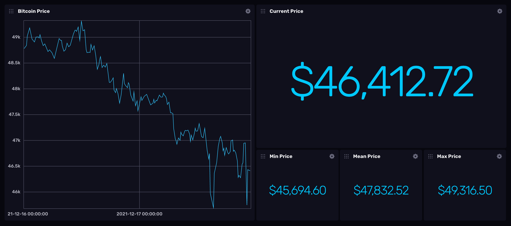

# Sample Data Template – Bitcoin

This InfluxDB Template can be used to quickly load and visualize sample Bitcoin
price data ([provided by Coinbase](https://www.coinbase.com/)) in your InfluxDB Instance.



### Quick Install

#### InfluxDB UI

In the InfluxDB UI, go to Settings->Templates and enter this URL: https://raw.githubusercontent.com/influxdata/community-templates/master/sample-data-bitcoin/sample-data-bitcoin.yml

#### Influx CLI
If you have your InfluxDB credentials [configured in the CLI](https://docs.influxdata.com/cloud/reference/cli/influx/config/), you can install this template with:

```
influx apply -u https://raw.githubusercontent.com/influxdata/community-templates/master/sample-data-bitcoin/sample-data-bitcoin.yml
```

### Included Resources

- 1 Bucket: `sampledata`, 7d retention
- 1 Dashboard: `Bitcoin Price`
- 1 Task: `Sample Data - Bitcoin`
- 1 Variable: `currency`
- 1 Label: `Sample data`

## Contact

- Author: Scott Anderson
- Email: scott@influxdata.com
- Github: [@sanderson](https://github.com/sanderson)
- Influx Slack: [@scott](https://influxdata.com/slack)