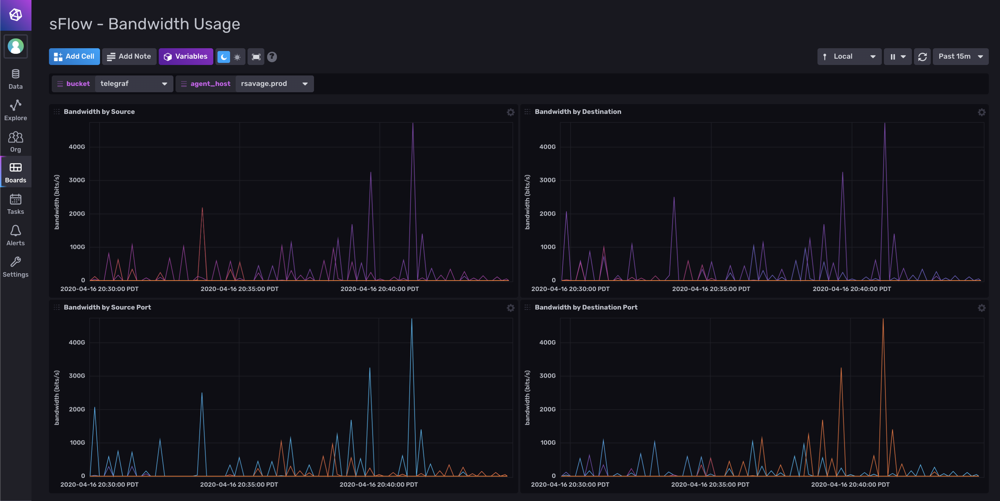
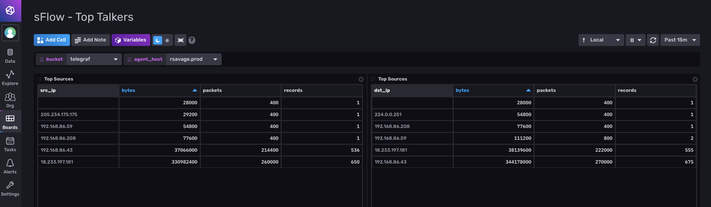

## sFlow Monitoring Template

This InfluxDB Template can be used to monitor traffic from sFlow sources.





### Quick Install

If you have your InfluxDB credentials [configured in the CLI](Vhttps://v2.docs.influxdata.com/v2.0/reference/cli/influx/config/), you can install this template with:

```
influx pkg -u https://raw.githubusercontent.com/influxdata/community-templates/master/sflow/sflow.yml
```

### Included Resources

- 1 Bucket: `sflow_data`, 2d retention
- Labels: `sFlow`, `Network Monitoring`, and Telegraf Plugin Labels
- 1 Telegraf Configuration
- 4 Dashboards: `sFlow - Top Talkers`, `sFlow - Source/Destination Traffic`, `sFlow - Ingress/Egress Traffic`, `sFlow - Bandwidth Usage`
- 6 Variable: `sflow_dest`, `agent_host`, `egress_interface`, `sflow_source`, `ingress_interface`, `sflow_metric`

## Setup Instructions

  General instructions on using InfluxDB Templates can be found in the [use a template](../docs/use_a_template.md) document.
    
  The data for the dashboard is populated by the included Telegraf configuration which includes the sFlow Input. You may need to customize the input configuration, specific the `service_address` value, depending on where your sFlow packets are coming from. More information can be found in the [Telegraf sFlow Input documentation](https://github.com/influxdata/telegraf/tree/master/plugins/inputs/sflow).
  
  The Telegraf Configuration requires the following environment variables:
    
  - `INFLUX_TOKEN` - The token with the permissions to read Telegraf configs and write data to the `telegraf` bucket. You can just use your master token to get started.
  - `INFLUX_ORG` - The name of your Organization (this will be your email address on the InfluxDB Cloud free tier)
  - `INFLUX_HOST` - The URL of your InfluxDB host (this can your localhost, a remote instance, or InfluxDB Cloud)

  You **MUST** set these environment variables before running Telegraf using something similar to the following commands
    
  - This can be found on the `Load Data` > `Tokens` page in your browser: `export INFLUX_TOKEN=TOKEN`
  - Your Organization name can be found on the Settings page in your browser: `export INFLUX_ORG=my_org`

## Running Telegraf

  To gather sFlow data from your network, [download and install Telegraf](https://portal.influxdata.com/downloads/). InfluxData provides native packages for a number of distributions as well as binaries that can be executed directly.

  Start Telegraf using the instructions from the `Load Data` > `Telegraf` > `Setup Instructions` link in the UI.

## Customizations

You can customize it based on your sFlow setup. More information can be found in the [Telegraf sFlow Input documentation](https://github.com/influxdata/telegraf/tree/master/plugins/inputs/sflow).

## Contact

- Author: Russ Savage
- Email: russ@influxdata.com
- Github: [@russorat](https://github.com/russorat)
- Influx Slack: [@russ](https://influxdata.com/slack)