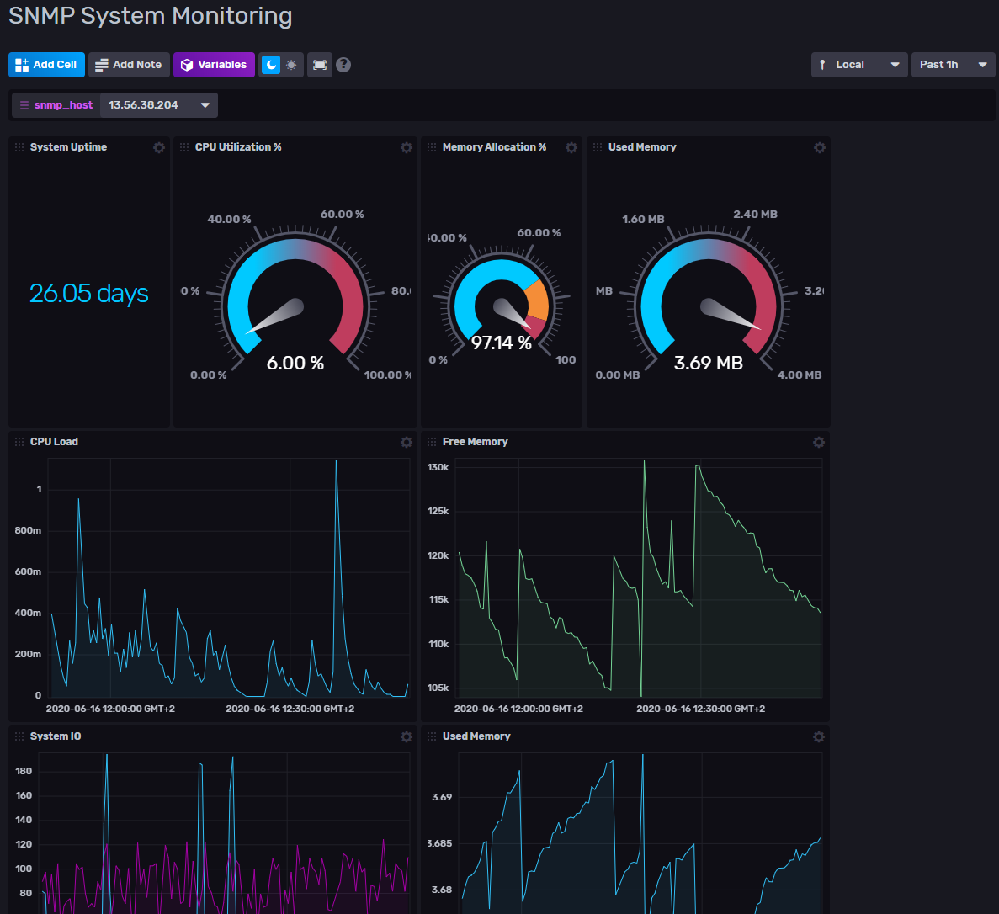

# SNMP Monitoring Template

Provided by: [bonitoo.io](.)

This template provides several dashboards showing metrics provided via SNMP protocol. It provides both an example of system SNMP stats and examples from Mikrotik and Cisco devices.

### Dashboard examples



### Quick Install

If you have your InfluxDB credentials [configured in the CLI](Vhttps://v2.docs.influxdata.com/v2.0/reference/cli/influx/config/), you can install this template with:

```
influx apply -u https://raw.githubusercontent.com/influxdata/community-templates/master/snmp/snmp.yml
```

## Included Resources

This template includes the following:

    - 1 Bucket: `snmp`, 1d retention
    - 3 Labels: `inputs.net`,`inputs.system`,`SNMP`
    - 3 Telegraf Configurations: `Linux SNMP`, `Cisco SNMP`, `Mikrotik SNMP`
    - 0 Checks: 
    - 3 Dashboards: `SNMP System Monitoring`, `SNMP Mikrotik Monitoring`, `SNMP Network Monitoring`
    - 2 Variables: `snmp_host`, and `snmp_ifName`

## Setup Instructions

Load the dashboards and use the [SNMP plugin](https://github.com/influxdata/telegraf/tree/master/plugins/inputs/snmp) into your
environment.

Include the Telegraf `inputs.snmp` plugin in your Telegraf configuration and start Telegraf. There are multiple configuration files per specific device.
SNMP tools must be installed on the device with Telegraf. If labels are used in OIDs, appropriate MIB files must be installed as well.

Example for Ubuntu: `sudo apt install snmp snmp-mibs-downloader`

For Linux SNMP monitoring SNMP server must be installed and properly configured.

Example for Ubuntu: `sudo apt install snmpd`

### Telegraf    
The data for the dashboard is populated by the included Telegraf configuration. The Telegraf Configuration requires the following environment variables
    
  - `INFLUX_TOKEN` - The token with the permissions to read Telegraf configs and write data to a bucket. You can just use your master token to get started.
  - `INFLUX_ORG` - The name of your Organization (this will be your email address on the InfluxDB Cloud free tier)
  - `INFLUX_HOST` - The URL of your InfluxDB host (this can your localhost, a remote instance, or InfluxDB Cloud)
  - `INFLUX_BUCKET` - The name of your bucket (default name is `snmp`)

You **MUST** set these environment variables before running Telegraf using something similar to the following commands
    
  - This can be found on the `Load Data` > `Tokens` page in your browser: `export INFLUX_TOKEN=TOKEN`
  - Your Organization name can be found on the Settings page in your browser: `export INFLUX_ORG=my_org`

Each Telegraf configuration requires to update inputs.snmp section to configure SNMP connection parameters.

## Customizations

Extend the telegraf configuration using SNMP OID codes to process more metrics.

## Contact


Author: Miroslav Malecha, https://www.bonitoo.io
