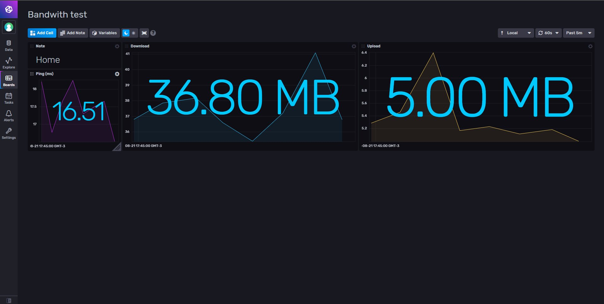

# Speedtest template for InfluxDB v2.0

Provided by: Ignacio Van Droogenbroeck

This template offer a view of your Internet connection Speed. 



### Quick Install

If you have your InfluxDB credentials [configured in the CLI](Vhttps://v2.docs.influxdata.com/v2.0/reference/cli/influx/config/), you can install this template with:

```
influx apply -u https://raw.githubusercontent.com/influxdata/community-templates/master/speedtest/speedtest.yml
```

## Included Resources

    - 1 Telegraf Configuration: 'speedtest-config'
    - 1 Dashboards: 'speedtest'
    - 1 Label: 'speedtest'
    - 1 Bucket: 'speedtest'

## Setup Instructions

General instructions on using InfluxDB Templates can be found in the [use a template](../docs/use_a_template.md) document.
    
    Telegraf Configuration requires the following environment variables
    - `INFLUX_TOKEN` - The token with the permissions to read Telegraf configs and write data to the `telegraf` bucket. You can just use your operator token to get started.
    - `INFLUX_ORG` - The name of your Organization.
    - `INFLUX_HOST` - The address of you InfluxDB

In order to use this template, you must install speedtest-cli. If you're using Debian based distributions, you need to run <code>sudo apt install speedtest-cli</code>

## Contact

Author: Ignacio Van Droogenbroeck

Email: ignacio[at]vandroogenbroeck[dot]net

Github and Gitlab user: @xe-nvdk 

Influx Slack: Ignacio Van Droogenbroeck
