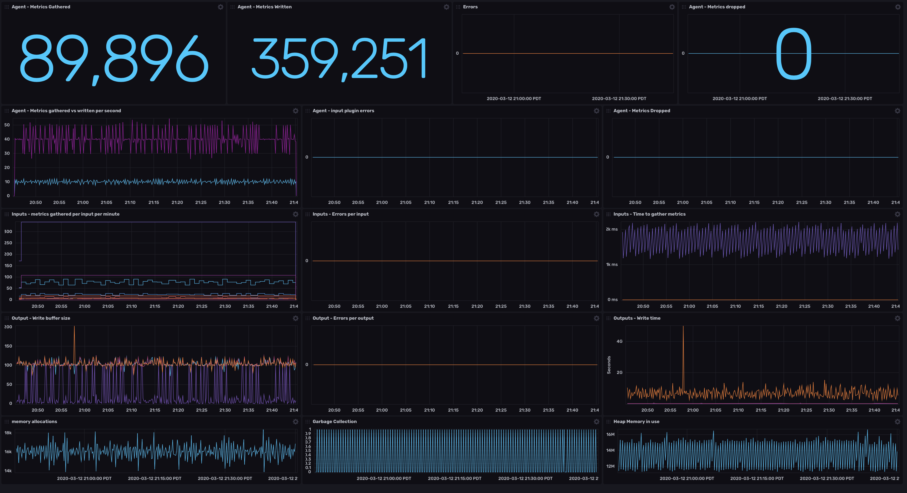

# Telegraf Dashboard

This is a dashboard for the telegraf service. It shows metrics collected, graphs errors, and shows throughput rates for inputs, outputs, and time spent collecting and writing metrics.

Provided by: Steven Soroka



## Included Resources

- 1 Dashboard: `Telegraf`
- 1 Bucket: `Telegraf` - 7 day retention
- 1 Telegraf config - Internal metrics collection and InfluxDB v2 output

## Setup Instructions

This Telegraf dashboard assumes you've enabled a the inputs.internal plugin in Telegraf, and that you're collecting them to a bucket named `Telegraf` in your Influx Cloud account. 

**Example telegraf.conf**

```toml
[[inputs.internal]]
  ## If true, collect telegraf memory stats.
  collect_memstats = true

[[outputs.influxdb_v2]]	
  ## influx cloud URL
  urls = ["${INFLUX_HOST}"]

  ## Token for authentication.
  token = "${INFLUX_TOKEN}"

  ## Organization is the name of the organization you wish to write to
  organization = "${INFLUX_ORG}"

  ## Destination bucket to write into.
  bucket = "${TELEGRAF_BUCKET}"
```

Required Environment variables

```sh
# Replace this with your cloud account URL. You may not be in the same region
INFLUX_HOST="https://us-west-2-1.aws.cloud2.influxdata.com"
INFLUX_TOKEN="your-influx-cloud-token-here"
INFLUX_ORG="your-influx-org-identifier"
TELEGRAF_BUCKET="Telegraf"
```

## Installation

See [How to use a Template](../docs/use_a_template.md) for detailed instructions on how to load a template.

___example___

```sh
export TELEGRAF_MANIFEST_URL=https://raw.githubusercontent.com/influxdata/community-templates/master/telegraf/manifest.yml

influx pkg --url $TELEGRAF_MANIFEST_URL \
           --org $INFLUX_ORG \
           --host $INFLUX_HOST \
           --token $INFLUX_TOKEN
```

## Contact

Author: Steven Soroka

Github: @ssoroka

Influx Community Slack: @Steven Soroka