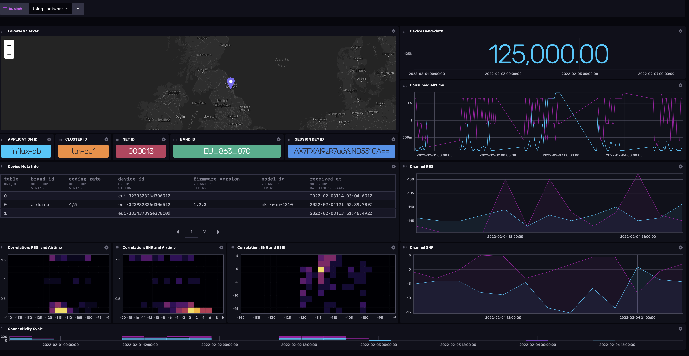

# The Thing Network

Provided by: Jay Clifford

This InfluxDB Template can be used to monitor device and network metrics from the Thing Network community edition. 

The goal of this template is to provide connectivity and network stats from LoRaWAN devices connecting to the Thing Network. This template monitors the following assets:
- LoRaWAN server location
- Device Bandwidth
- ID: application, cluster, NET, Band, session
- Device Meta information: brand, code rate, device ID, firmware version, model ID, last known message
- Consumed Airtime
- Channel RSSI
- Channel SNR
- Correlation: SNR to Airtime, RSSI to Airtime, SNR to RSSI
- Connectivity cycles

##### Dashboard examples



This template requires an account with Thing Network Community. Make one [here](https://eu1.cloud.thethings.network/console/).

### Quick Install

#### InfluxDB UI

In the InfluxDB UI, go to Settings->Templates and enter this URL: https://raw.githubusercontent.com/influxdata/community-templates/master/thing_network/thing_network.yml

#### Influx CLI
If you have your InfluxDB credentials [configured in the CLI](https://v2.docs.influxdata.com/v2.0/reference/cli/influx/config/), you can install this template with:

```
influx apply -u https://raw.githubusercontent.com/influxdata/community-templates/master/thing_network/thing_network.yml
```

## Included Resources
  - 1 Bucket: `thing_network_stats`, 30d retention
  - 1 Telegraf Configuration
  - 1 Dashboards: `Thing Network`
  - 1 Variables: `bucket` 

## Setup Instructions

General instructions on using InfluxDB Templates can be found in the [use a template](../docs/use_a_template.md) document.

For instructions on how to connect the Thing Network to InfluxDB [here]()

## Customizations

NA 

## Contact

Author: Jay Clifford

Email: [jclifford@influxdata.com](mailto:jclifford@influxdata.com)

Github: [@Jayclifford345](https://github.com/Jayclifford345)

Influx Slack: [Jay Clifford](https://influxcommunity.slack.com/team/U02E8MP82SW)