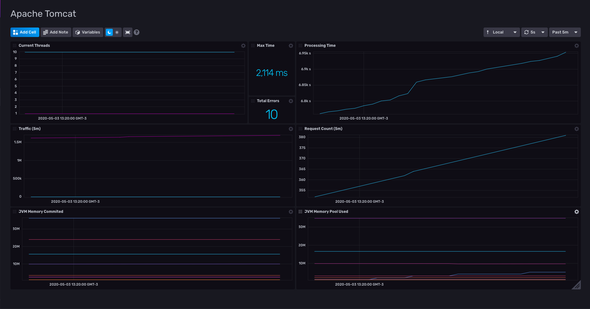

# Tomcat Dashboard for InfluxDB v2

Provided by: Ignacio Van Droogenbroeck

This Dashboard offers you information about your Apache Tomcat instance. Current Threads, Processing Time, Traffic, Request Count and more.



### Quick Install

#### InfluxDB UI

In the InfluxDB UI, go to Settings->Templates and enter this URL: https://raw.githubusercontent.com/influxdata/community-templates/master/tomcat/tomcat.yml

#### Influx CLI
If you have your InfluxDB credentials [configured in the CLI](https://v2.docs.influxdata.com/v2.0/reference/cli/influx/config/), you can install this template with:

```
influx apply -u https://raw.githubusercontent.com/influxdata/community-templates/master/tomcat/tomcat.yml
```

## Included Resources

  - 1 Telegraf: 'Tomcat Inputs'
  - 1 Dashboards: 'Apache Tomcat'
  - 1 Bucket: 'tomcat'
  - 1 Label: 'tomcat'

## Setup Instructions

General instructions on using InfluxDB Templates can be found in the [use a template](../docs/use_a_template.md) document.
    
Telegraf Configuration requires the following environment variables
  - `INFLUX_HOST` - The host running InfluxDB
  - `INFLUX_TOKEN` - The token with the permissions to read Telegraf configs and write data to the `telegraf` bucket. You can just use your operator token to get started.
  - `INFLUX_ORG` - The name of your Organization.

As the bucket was provided in this template, you need to set the following environment data <k>export INFLUX_BUCKET=tomcat</k>. Also is required to specify trough variables the connection string of Tomcat using <k>export TOMCAT_CONNECTION_STRING="you-server:8080//manager/status/all?XML=true"</k> and the user and password.

## Contact

Author: Ignacio Van Droogenbroeck

Email: ignacio[at]vandroogenbroeck[dot]net

Github and Gitlab user: @xe-nvdk 

Influx Slack: Ignacio Van Droogenbroeck
