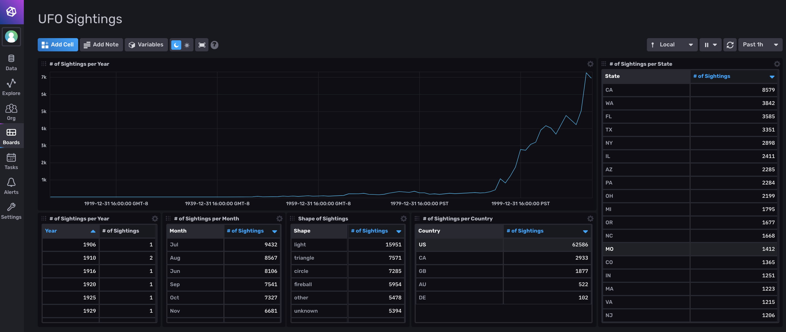

# UFO Sightings Template

Provided by: Russ Savage

This template is designed to help you load and analyze data from the [Kaggle UFO Sightings dataset](https://www.kaggle.com/NUFORC/ufo-sightings/data).



## Included Resources

  - 1 Bucket: `ufo_sightings`, Infinite retention
  - 1 CSV Loading Configuration
  - 1 Dashboard: `UFO Sightings`
  - 1 Label: `ufos`

## Setup Instructions
    
  1. Download the UFO Sightings dataset
      - The dataset we will be working with is available in the [Kaggle UFO Sightings dataset](https://www.kaggle.com/NUFORC/ufo-sightings/data). Follow the instructions to download the dataset to your machine (free Kaggle account required). Unzip the downloaded file so you have a folder with two csv files in it, `complete.csv` and `scrubbed.csv`. We will be working with the `scrubbed.csv` file.
  1. Set up InfluxDB for loading the data
      - We will load this data into Influx, so we will need a place to put it and a dashboard to view it. Create a new bucket to store this data and a dashboard to view it with the following command:

    ./influx pkg -f ufo_data.yml

  1. Load the CSV data into InfluxDB
      - You can load the csv file using the `influx write` command.

    ./influx write \
    -f ~/Downloads/ufo-sightings/scrubbed.csv \
    --skipHeader=1 \
    --header "#constant measurement,ufos" \
    --header "t|dateTime:1/2/2006 15:04,city|tag,state|tag,country|tag,shape|tag,duration_sec|double,duration_str|string,comments|string,date_posted|ignored,latitude|double,longitude|double" \
    -b ufo_data \
    --skipRowOnError

  - NOTE: You will see a few errors due to issues in the CSV file. If you want to fix them, just use the following `sed` commands

    ```
    sed -i.bak 's/24:00/00:00/g' scrubbed.csv && sed -i.bak 's/\`//g' scrubbed.csv && sed -i.bak 's/33q.200088/33.200088/g' scrubbed.csv
    ```

  1. View the dashboard
      - Open up your browser to http://localhost:9999 and view your data.

## Customizations

You can easily load this into an InfluxDB Cloud instance as well, but you will need to have the ability to create a bucket with an infinite retention period for the dashboard to work properly.

## Contact

- Author: Russ Savage
- Email: russ@influxdata.com
- Github: [@russorat](https://github.com/russorat)
- Influx Slack: [@russ](https://influxdata.com/slack)
