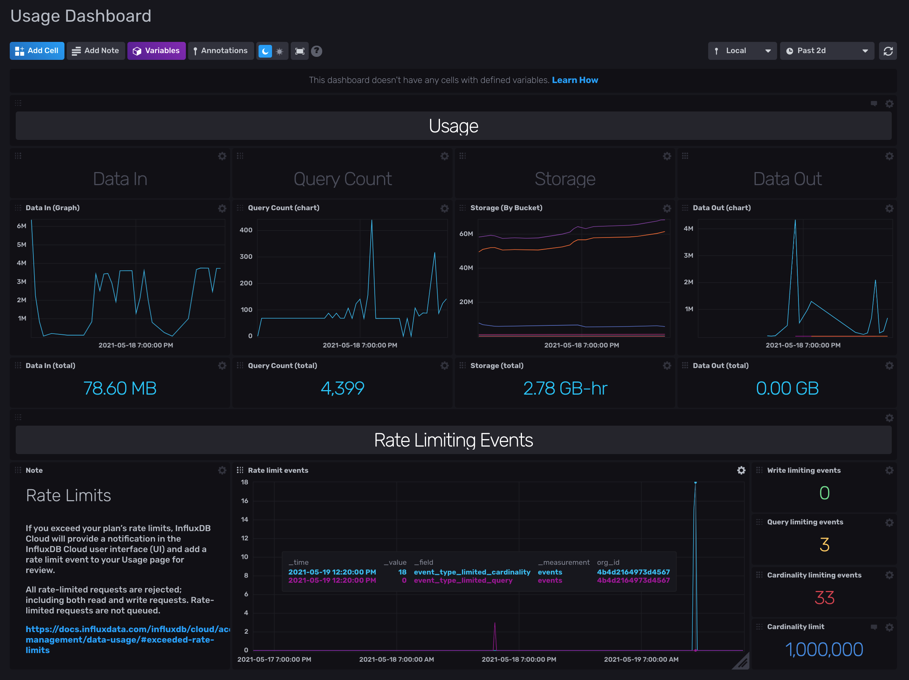

# Cloud 2 Usage Dashboard

Provided by: InfluxData

This InfluxDB template uses the `experimental/usage` Flux API package to help InfluxDb Cloud users monitor their organization's data usage, and to alert users when rate limited events occur. The template is only compatible with the Cloud version of InfluxDB 2.


> The Usage Dashboard gives you detailed and customizable insight into your organization's data usage and any rate limit events that may occur.



### Quick Install

#### InfluxDB UI

In the InfluxDB UI, go to Settings->Templates and enter this URL: https://github.com/influxdata/community-templates/blob/master/usage_dashboard/usage_dashboard.yml

#### Influx CLI
If you have your InfluxDB credentials [configured in the CLI](https://v2.docs.influxdata.com/v2.0/reference/cli/influx/config/), you can install this template with:

```
influx apply -u https://raw.githubusercontent.com/influxdata/community-templates/master/usage_dashboard/usage_dashboard.yml
```

## Included Resources

This template comes with three resources (`Dashboard`, a sample `Task` for creating an alert and a `Label`). The `Task` will need to be configured for your specific Slack notification endpoint, but then can be cloned and modified for any of the Limit Events you wish to monitor.


  - 1 Dashboard: `Usage Dashboard`
  - 1 Task: `Cardinality Limit Alert (usage dashboard)`
  - 1 Label: `usage_dashboard`

## Setup Instructions

General instructions on using InfluxDB Templates can be found in the [use a template](../docs/use_a_template.md) document.


**Modifying the Task:**

In order to receive Slack notifications from the included `Task` you will need to have a `Slack Notification Endpoint` configured for your InfluxDB Cloud account. If you do not already have a notification endpoint configured, I recommend this helpful article https://www.influxdata.com/blog/tldr-influxdb-tech-tips-configuring-slack-notification-with-influxdb/ . You can also refer to the official documentation for setting up a Slack endpoint https://docs.influxdata.com/influxdb/cloud/reference/flux/stdlib/slack/endpoint/

Once you have an endpoint configured, you simply need to update the following line in the task to point to your endpoint.
```
slackWebhook = "https://hooks.slack.com/services/####/####/####"
```

## Customizations

### Task
The `Task` has been designed to be easily customizable to your needs. By default, the task monitors the `event_type_limited_cardinality` value returned by the `usage.from()` API call, and sends a Slack alert whenever this value passes the `threshold` value (the default value has been set to `1`). You can customize this by:
  - Changing the `threshold` value to be alerted at higher values
  - Specify a particular Slack Channel to receive the notification be setting the `slackChannel = "#{channel}"`
  - Set alerts for monitoring Write or Query events by modifying `event_type_limited_cardinality` to either `event_type_limited_write` or `event_type_limited_query`

### Dashboard
You can customize the `Dashboard` to fit your organization's specific needs. Some customization ideas include:
  - Set custom `threshold` values on your usage metric values
  - Experiment with different `Graph` types to visualize the data
  - Match your `Limit Events` `threshold` values to whatever you set in your `alerts`

### Usage API
The `Dashboard` and `Task` take advantage of the Flux `experimental/usage` package, which you can use to customize the template content or build your own! For more information on this Flux package, check out our documentation https://docs.influxdata.com/influxdb/cloud/reference/flux/stdlib/experimental/usage/

## Contact


Author: John Corrigan

Email: jcorrigan@influxdata.com

Github: @corriganjohn

Influx Slack: @John Corrigan
