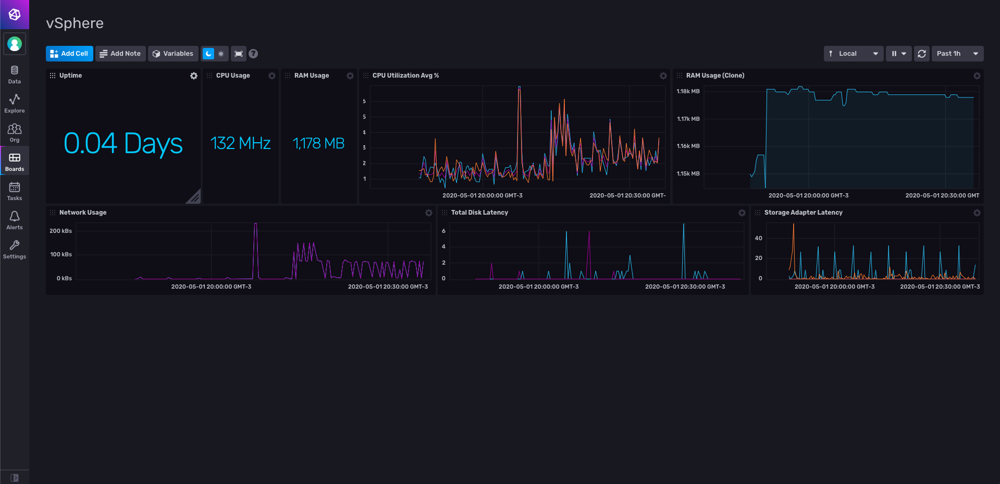

# vSphere Dashboard for InfluxDB v2

Provided by: Ignacio Van Droogenbroeck

This Dashboard offers you information about your vSphere host. Uptime, CPU, RAM, Graph about CPU and RAM Utilization, Network Usage, Total Disk Latency (Write and Read) and Storage Adapter Latency

## Included Resources

    - 1 Telegraf Configuration
    - 1 Dashboards: vsphere.yml
    - 1 bucket: 'vsphere'
    - 1 label: 'vsphere' 

## Setup Instructions

General instructions on using InfluxDB Templates can be found in the [use a template](../docs/use_a_template.md) document.
    
    Telegraf Configuration requires the following environment variables
    - `INFLUX_TOKEN` - The token with the permissions to read Telegraf configs and write data to the `telegraf` bucket. You can just use your master token to get started.
    - `INFLUX_ORG` - The name of your Organization.
    - `INFLUX_HOST` - The address of you InfluxDB
    - `INFLUX_BUCKET` - The name of the Bucket. If you going to use the bucket included, you need to export the variable. Ex: <code>export INFLUX_BUCKET=vsphere</code>

In order to use this Dashboard, you need to specify the address to the vSphere (EX: https://vsphere/sdk), also, you need to provide username and password in Telegraf Configuration.

## Contact

Author: Ignacio Van Droogenbroeck

Email: ignacio[at]vandroogenbroeck[dot]net

Github and Gitlab user: @xe-nvdk 

Influx Slack: Ignacio Van Droogenbroeck
