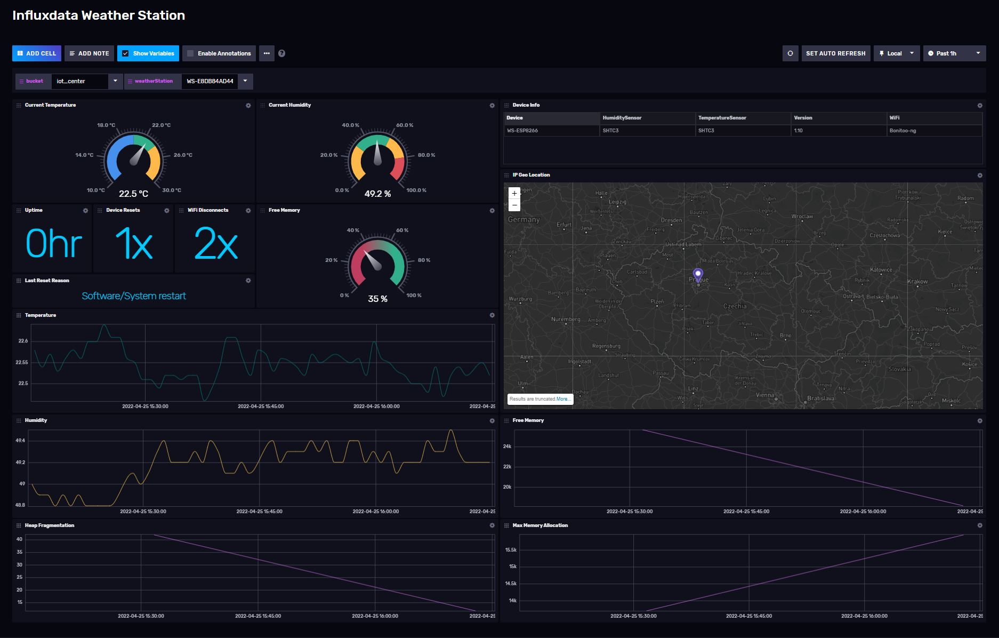

# Influxdata Weather Station Template

Provided by: [bonitoo.io](.)

Influxdata Weather station is a smart IoT device that shows various information on the embedded OLED display. It was originaly made as a present for visitors of Influxdata Days.

For more details please visit: [GitHub](https://github.com/bonitoo-io/weather-station)

This template can be used to display data from the Weather Station with following dashboards:



### Quick Install

#### InfluxDB UI

In the InfluxDB UI, go to Settings->Templates and enter this URL: https://raw.githubusercontent.com/influxdata/community-templates/master/weather_station/influxdata_weather_station.yml

#### Influx CLI

If you have your InfluxDB credentials [configured in the CLI](https://v2.docs.influxdata.com/v2.0/reference/cli/influx/config/), you can install this template with:

```
influx apply -u https://raw.githubusercontent.com/influxdata/community-templates/master/weather_station/influxdata_weather_station.yml
```

## Included Resources

- 1 Label: `IoT`,`Influxdata`
- 1 Dashboard: `Influxdata Weather Station`
- 2 Variables: `bucket`, `weatherStation`

## Setup Instructions

General instructions on using InfluxDB Templates can be found in the [use a template](../docs/use_a_template.md) document.

### Requirements:

#### Influxdata Weather Station:

- https://github.com/bonitoo-io/weather-station

## Contact

- Email: tomas.klapka@bonitoo.io
