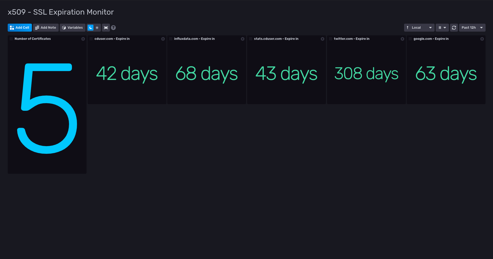

# x509 SSL Certificates Monitoring Dashboard

Provided by: Ignacio Van Droogenbroeck

This Dashboard is very simple but can help you with information about your x509 certificates about to expire. You can know how much certificates you're monitoring and the days to expire to each one of them.



### Quick Install

If you have your InfluxDB credentials [configured in the CLI](Vhttps://v2.docs.influxdata.com/v2.0/reference/cli/influx/config/), you can install this template with:

```
influx apply -u https://raw.githubusercontent.com/influxdata/community-templates/master/x509/x509.yml
```

## Included Resources

    - 1 Telegraf Configuration
    - 1 Dashboards: x509.yml
    - 1 bucket: 'x509'
    - 1 label: 'x509' 

## Setup Instructions

General instructions on using InfluxDB Templates can be found in the [use a template](../docs/use_a_template.md) document.
    
    Telegraf Configuration requires the following environment variables
    - `INFLUX_TOKEN` - The token with the permissions to read Telegraf configs and write data to the `telegraf` bucket. You can just use your operator token to get started.
    - `INFLUX_ORG` - The name of your Organization.
    - `INFLUX_HOST` - The address of you InfluxDB
    - `INFLUX_BUCKET` - The name of the Bucket. If you going to use the bucket included, you need to export the variable. Ex: <code>export INFLUX_BUCKET=x509</code>

In order to use this template, before import, you need to specify the certificates you want monitor in the x509.yml file.

## Contact

Author: Ignacio Van Droogenbroeck

Email: ignacio[at]vandroogenbroeck[dot]net

Github and Gitlab user: @xe-nvdk 

Influx Slack: Ignacio Van Droogenbroeck
