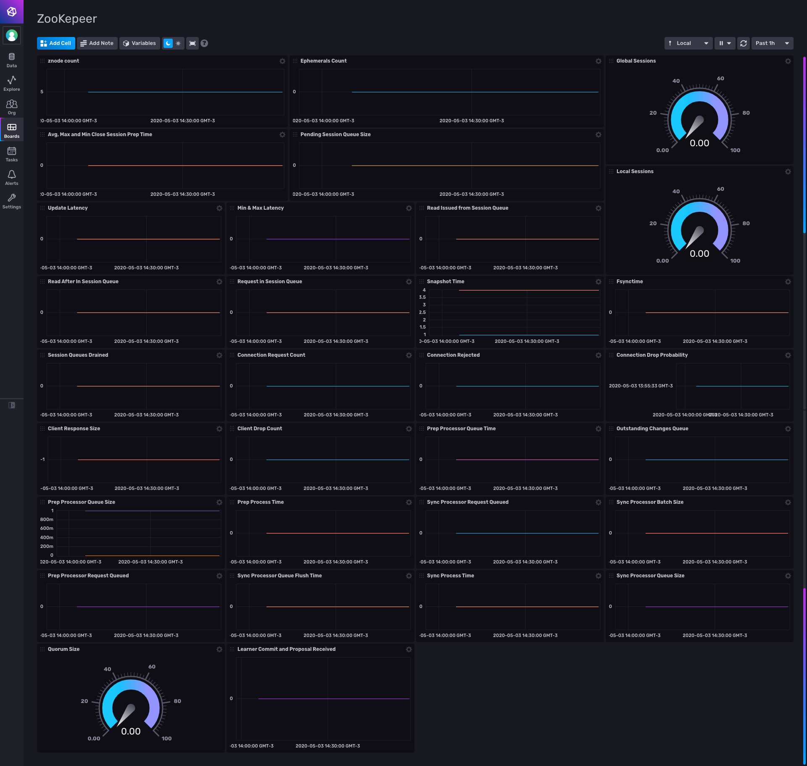

# ZooKeeper Dashboard for InfluxDB v2

Provided by: Ignacio Van Droogenbroeck

This Dashboard offers you information about your ZooKeeper. Almost all of the metrics can be exploted are in this dashboard. https://github.com/influxdata/telegraf/tree/master/plugins/inputs/zookeeper



### Quick Install

If you have your InfluxDB credentials [configured in the CLI](Vhttps://v2.docs.influxdata.com/v2.0/reference/cli/influx/config/), you can install this template with:

```
influx apply -u https://raw.githubusercontent.com/influxdata/community-templates/master/zookeeper/zookeeper.yml
```

## Included Resources

    - 1 Telegraf Configuration
    - 1 Dashboards: 'zookeeper'
    - 1 Bucket: 'zookeeper'
    - 1 Label: 'zookeeper'

## Setup Instructions

General instructions on using InfluxDB Templates can be found in the [use a template](../docs/use_a_template.md) document.
    
    Telegraf Configuration requires the following environment variables
    - `INFLUX_TOKEN` - The token with the permissions to read Telegraf configs and write data to the `telegraf` bucket. You can just use your operator token to get started.
    - `INFLUX_ORG` - The name of your Organization.
    - `INFLUX_HOST` - The address of you InfluxDB
    - `INFLUX_BUCKET` - The name of the Bucket. In this case, the bucket was included, so, you need to specify 'INFLUX_BUCKET=zookeeper'
    
In order to use this Dashboard, you need to specify the address to the ZooKeeper client (EX: https://localhost:2181) as variable 'ZOOKEEPER_HOST'

<code>$ export ZOOKEEPER_HOST=https://localhost:2181</code>

## Contact

Author: Ignacio Van Droogenbroeck

Email: ignacio[at]vandroogenbroeck[dot]net

Github and Gitlab user: @xe-nvdk 

Influx Slack: Ignacio Van Droogenbroeck